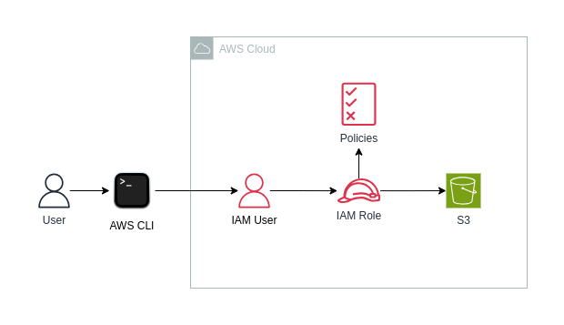

# Terraform AWS IAM User
Create an IAM User and grant access to assume an IAM Role. Allow the user to use the AWS CLI to manipulate objects in the S3 Bucket.

### Requirements
- [AWS Account](https://docs.aws.amazon.com/accounts/latest/reference/manage-acct-creating.html)
- [AWS CLI](https://docs.aws.amazon.com/streams/latest/dev/setup-awscli.html)
- [Terraform](https://developer.hashicorp.com/terraform/tutorials/aws-get-started/install-cli)

### Set Up
1. Copy the content of `terraform.tfvars.sample` into a new file called `terraform.tfvars`. Complete the variables with desired ones:
```
aws_region    = "<aws_region>"
bucket_name   = "<bucket_name>"
iam_user_name = "<iam_user_name>"
```
2. `terraform init`
3. `terraform plan`
4. `terraform apply`

### Impersonate IAM User & Assume Role
All you need is to get the (AWS Access Keys)[https://docs.aws.amazon.com/sdkref/latest/guide/feature-static-credentials.html] to authenticate as the new IAM User. Access keys where provision by Terraform, so we need to use those keys in the AWS CLI.

In a new terminal, execute the following command to export keys as environment variables:
```bash
export $(printf "AWS_ACCESS_KEY_ID=%s AWS_SECRET_ACCESS_KEY=%s" \
    $(echo \
        $(terraform output -raw access_key_id) \
        $(terraform output -raw secret_access_key) \
    )) 
```

Now you can use the created IAM User. However, we need to assume the `S3SupportRole` role to interact with the S3 Bucket.

Execute the following command:
```bash
export $(printf "AWS_ACCESS_KEY_ID=%s AWS_SECRET_ACCESS_KEY=%s AWS_SESSION_TOKEN=%s" \
  $(aws sts assume-role \
    --role-arn $(terraform output -raw role_arn) \
    --role-session-name S3SupportRoleSession \
    --query "Credentials.[AccessKeyId,SecretAccessKey,SessionToken]" \
    --output text
  ))
```

Now you can interact with your S3 Bucket, with some of these commands:
```bash
aws s3 ls s3://<bucket_name>
aws s3 cp <file> <bucket_name>
aws s3 rm s3://<bucket_name>/<file>
```

### Clean Up
Execute:
```bash
terraform destroy
```

**WARNING**: You need to empty the S3 bucket before destroying resources.

### Architecture
